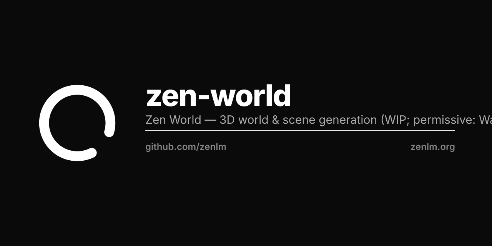

# Zen World

Immersive 3D world and panoramic scene generation.

> **Status: work in progress.** Built on a permissive, commercially-licensed foundation (no non-commercial or restricted-weight dependencies). The Zen model is not yet trained/integrated here — this provides the licensing, attribution, and integration scaffold.

## Foundation
Built on **Wan2.1 / Wan2.2** (Alibaba, Apache-2.0) — permissive and commercial-friendly. The shipped weights (https://huggingface.co/zenlm/zen-world) are already based on Wan2.1-T2V-14B (Apache-2.0).

## License
Apache License — see [LICENSE](LICENSE) and [NOTICE](NOTICE). Copyright 2025-2026 Zen Authors (https://zenlm.org).

## Roadmap
- [ ] Wire the Wan2.1/2.2 backbone as the world-generation pipeline
- [ ] Integrate the released Wan2.1-based weights
- [ ] Inference, evaluation, and release
